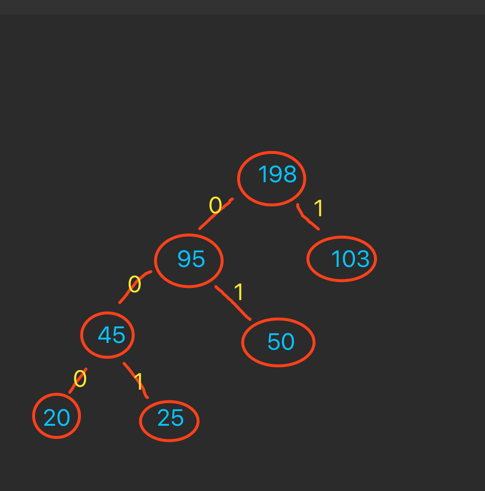

# 大长图加载

 * 1、先将图片加载到内存中
 * 2、开启复用，并创建区域解码器
 * 3、在获取到view的宽高，即onMeasure中进行创建加载图片的rect的区域
 * 4、在onDraw中复用bitmap，并将加载到的区域进行缩放，绘制到canvas中
 * 5、监听触摸的点击事件，交给GestureDetector ；
 * 6、在每次点击的时候就停止上一次的滑动事件
 * 7、处理触摸的滑动事件；
 * 8、添加滑动的惯性处理；
 * 9、最后进行计算

 # 顺便提一下 图片压缩的一个算法 哈夫曼树

     将图片的某一个像素的色值进行编号，并标号成二叉树的形式
     比如某一个像素点有103个#B02121 ，50个#B02122，25个#B02123，20个#B02124
     编号成哈夫曼树后,树的左子树都是0，右子树都是1，然后对应的 103 -> 1，20 -> 01，25 -> 001，20 -> 000，
     原来 103 -> 00000000 对应的是8个字节，现在是1个字节
     这样就减少了空间，算是无损压缩；
     但是：非常的耗费性能。
     

